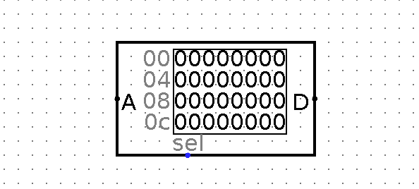

# 8-Bit-Computer-Designing
8 Bit Computer Designing From Scratch

### CPU 外部存储器设计

#### RAM 设计

#### ROM 设计

----

[ ` Read Only Memory - ROM ` ]

 - PROM
 - EPROM
 - EEPROM

> Logisim 实现



> 接口解析
```text
[ A:   Adress      ]    地址接口    输入想要读取数据的地址
[ D:   Data        ]    数据接口    读取数据从此接口输出
[ Sel: Chip Select ]    片选接口    输入 0 时可以锁定整个 ROM 无法读取
```
