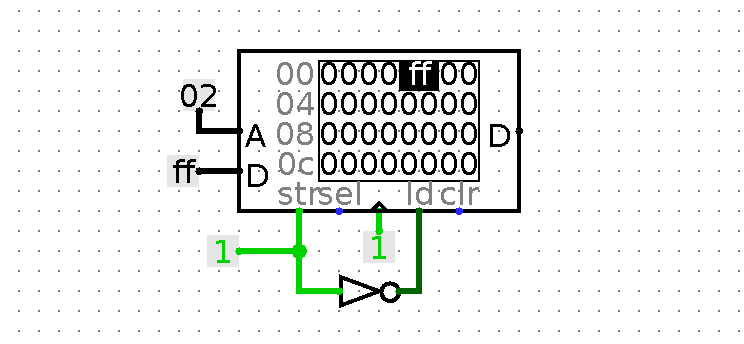

# 8-Bit-Computer-Designing
8 Bit Computer Designing From Scratch

### CPU 外部存储器设计

#### RAM 设计

----

> Logisim 实现


> 接口解析
```text
[ A:   Adress      ]    地址接口    接收需要被读取数据的地址
[ D:   Data        ]    数据接口    数据的 输入 / 输出 接口
[ ld:  Load        ]    载入接口    输入 1 时 允许从 RAM 读取数据
[ str: Store       ]    保存接口    输入 1 时 允许向 RAM 写入数据
[ Clr: Clear       ]    重置接口    输入 1 时 异步将整个 RAM 数据重置为 0
[ Sel: Chip Select ]    片选接口    输入 0 时 锁定整个 RAM
```

> 向地址 `02` 写入数据



> 读取 `02` 地址上的数据


#### ROM 设计

----

[ ` Read Only Memory - ROM ` ]

 - PROM
 - EPROM
 - EEPROM

> Logisim 实现


> 读取 `02` 地址上的数据


> 接口解析
```text
[ A:   Adress      ]    地址接口    接收需要被读取数据的地址
[ D:   Data        ]    数据接口    读到的数据从此接口输出
[ Sel: Chip Select ]    片选接口    输入 0 时可以锁定整个 ROM
```
